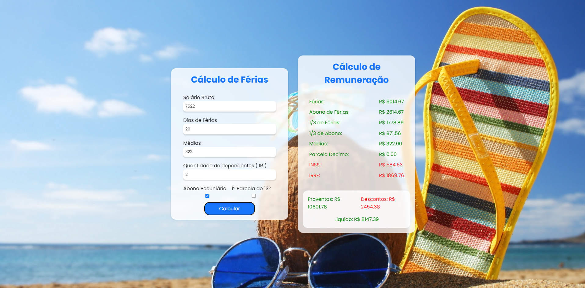

# 🔑 **Vacation Calculator**

Este projeto é uma ferramenta abrangente para o cálculo de férias, permitindo que os usuários obtenham uma visão detalhada dos ganhos e descontos relacionados às férias. O cálculo considera uma ampla gama de fatores, como salário base, dias de férias, médias salariais e deduções fiscais.

O código foi desenvolvido utilizando **JavaScript**, com uma abordagem modular que facilita a manutenção e extensão das funcionalidades.

---

## 🚀 **Funcionalidades**

- **Cálculo de Proventos de Férias**: Calcula o valor proporcional do salário de férias, incluindo um terço adicional obrigatório.
- **Cálculo de Abono Pecuniário**: Adiciona a opção de incluir um abono pecuniário com um terço proporcional.
- **Cálculo da Primeira Parcela do 13º Salário**: Permite o cálculo opcional da parcela do 13º salário.
- **Cálculo de Deduções**: Considera as deduções de INSS e IR com base no total de proventos.
- **Resultados Detalhados**: Exibe os valores calculados de proventos, deduções e total líquido de forma clara e organizada.

---

## 🛠️ **Tecnologias Utilizadas**

- **JavaScript**: Para toda a lógica de cálculo e manipulação do DOM.
- **HTML5**: Estruturação da página.
- **SCSS**: Estilização básica da interface.

---

## 🔧 **Como Executar o Projeto**

<a href="https://vinicius-rodriguess.github.io/Vacation-Calculator" target="_blank">Clique aqui para testar o projeto!</a>



Ou então:

1. **Clone este Repositório**:

   ```bash
   git clone https://github.com/Vinicius-Rodriguess/Vacation-Calculator.git
   cd vacation-calculator
   ```

2. **Abra o arquivo** index.html **em seu navegador** para utilizar a calculadora de férias.

---

## 🖥️ **Exemplo de Uso**

1. **Insira os dados necessários**: Informe o salário base, número de dias de férias, médias salariais e escolha as opções desejadas (abono pecuniário, 13º salário, etc.).
2. **Clique em "Calcular"**: O sistema realizará todos os cálculos automaticamente.
3. **Visualize os resultados**: Confira os valores detalhados de proventos, deduções e o total líquido.

---

## ✅ **Melhorias Futuras**

- Adicionar uma interface gráfica mais intuitiva e moderna.
- Implementar suporte para diferentes moedas e idiomas.
- Incluir a funcionalidade de exportação de resultados para PDF ou planilhas.
- Melhorar a precisão dos cálculos com atualizações constantes das tabelas de INSS e IR.

---

## 👨‍💻 **Autor**

**Vinicius Rodrigues**

- GitHub: [Vinicius-Rodriguess](https://github.com/Vinicius-Rodriguess)
- Email: rodrigues.vini.2004@gmail.com
